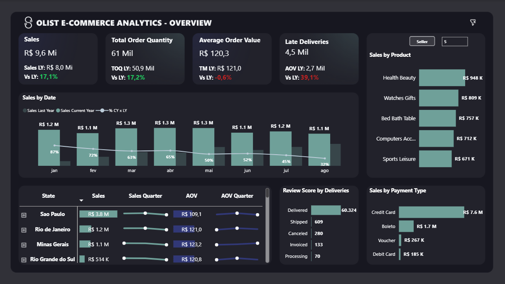
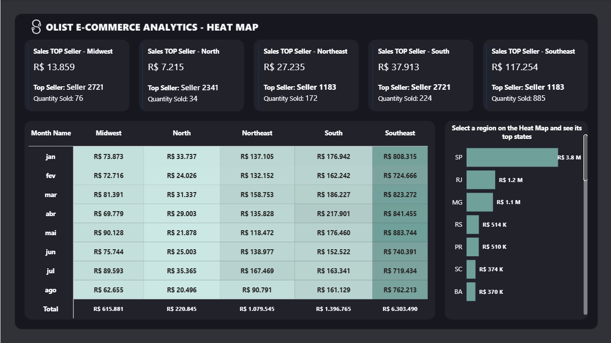
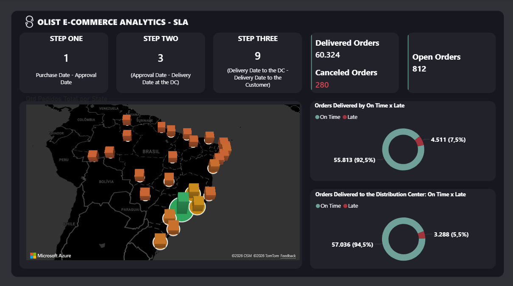
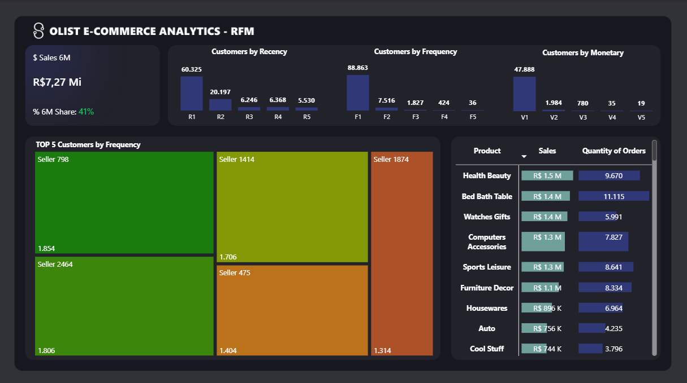

# 📊 Olist E-Commerce Analytics — Tech Challenge POSTECH DTAT Fase 1

> **Pergunta de Negócio Norteadora:**
> **"O crescimento do e-commerce brasileiro entre 2016 e 2018 foi sustentável ou foi impulsionado por uma base de clientes que não retorna, com gargalos logísticos que corroem a satisfação e comprometem a escalabilidade do negócio?"**

## 📎 Links

- 📊 [Visualizar Dashboard no Google Drive](https://drive.google.com/file/d/17U8y7YiToYnmakQgPHRCyooRiqpXt5Xq/view?usp=drive_link)
- 📝 [Apresentação Executiva](https://...)
- 🎥 [Vídeo Executivo (YouTube)](https://youtube.com/...)
- 📁 [Dataset — Kaggle](https://www.kaggle.com/datasets/olistbr/brazilian-ecommerce)


## 🗂️ Sumário

- [Contexto do Projeto](#contexto-do-projeto)
- [Dataset](#dataset)
- [Estrutura do Dashboard](#estrutura-do-dashboard)
  - [Página 1 — Overview](#página-1--overview)
  - [Página 2 — Region Heat Map](#página-2--region-heat-map)
  - [Página 3 — SLA (Logística)](#página-3--sla-logística)
  - [Página 4 — RFM (Comportamento de Clientes)](#página-4--rfm-comportamento-de-clientes)
- [Arquitetura de Dados](#arquitetura-de-dados)
- [Tecnologias Utilizadas](#tecnologias-utilizadas)
- [Principais Conclusões](#principais-conclusões)
- [Equipe](#equipe)

---

## Contexto do Projeto

Este projeto foi desenvolvido como entregável do **Tech Challenge da Fase 1 do curso DTAT (Data Analytics) da POSTECH**, cujo objetivo é transformar dados transacionais reais em uma **narrativa executiva voltada a investidores e acionistas** do setor de e-commerce brasileiro.

O desafio propõe a construção de um relatório analítico com base no **Brazilian E-Commerce Public Dataset by Olist**, cobrindo aproximadamente **100 mil pedidos realizados entre 2016 e 2018** em múltiplos marketplaces no Brasil.

A pergunta norteadora escolhida pelo grupo une as quatro dimensões analíticas do dashboard — receita, logística, satisfação e comportamento de clientes — em uma única tese de investimento: **crescimento com qualidade**.

---

## Dataset

**Fonte:** [Brazilian E-Commerce Public Dataset by Olist — Kaggle](https://www.kaggle.com/datasets/olistbr/brazilian-ecommerce)

| Tabela | Descrição |
|---|---|
| `customers` | ID, localização (CEP, cidade, estado) |
| `orders` | Status, timestamps de compra, aprovação e entrega |
| `order_items` | Produtos, sellers, preço, frete por item |
| `payments` | Tipo de pagamento, parcelas, valor |
| `order_reviews` | Score de avaliação, comentários |
| `products` | Categoria, dimensões e peso |
| `sellers` | Localização dos vendedores |
| `geolocation` | Coordenadas por CEP |
| `category_translation` | Tradução de categorias PT→EN |

> Os dados são reais e foram anonimizados pela Olist.

---

## Estrutura do Dashboard

O relatório é composto por **4 páginas interativas** no Power BI, navegáveis por botões de ação. Cada página responde a um eixo analítico distinto da pergunta norteadora.

---

### Página 1 — Overview

**Eixo:** Crescimento e Receita



**Visuais presentes:**
- **KPI Cards** — métricas-chave de volume, receita e ticket médio
- **Sales by Date** *(combo chart: linha + barras)* — evolução mensal de pedidos e receita, revelando sazonalidade e tendência de crescimento
- **Sales by Product** *(barras horizontais)* — ranking das categorias mais vendidas
- **Review Score by Deliveries** *(barras horizontais)* — correlação entre volume de entregas e satisfação do cliente
- **Sales by Payment Type** *(barras)* — participação dos meios de pagamento (cartão, boleto, etc.)
- **Sales by Seller** *(barras)* — identificação dos top sellers por receita

**Filtros disponíveis:** Período (ano/mês), estado, categoria, status do pedido, tipo de pagamento, seller.

**Insight-chave para investidores:** A curva de crescimento mensal demonstra expansão consistente, mas a análise cruzada com review score e tipo de pagamento revela qual parcela da receita tem base saudável versus estruturalmente frágil.

---

### Página 2 — Region Heat Map

**Eixo:** Distribuição Geográfica de Receita



**Visuais presentes:**
- **Heat Map: Monthly Sales by Region** *(pivot table com codificação de cor)* — visão mensal do desempenho por estado, permitindo identificar regiões em aceleração ou declínio
- **Sales by State** *(barras)* — ranking de estados por receita total
- **KPI Cards** — métricas regionais selecionadas

**Insight-chave para investidores:** A concentração de receita em SP, RJ e MG versus a sub-representação das regiões Norte e Nordeste indica onde há **maior potencial de expansão geográfica** — e onde gargalos logísticos limitam o crescimento.

---

### Página 3 — SLA (Logística)

**Eixo:** Eficiência Logística e Nível de Serviço



**Visuais presentes:**
- **KPI Cards de etapas** — Step 1 (compra → aprovação), Step 2 (aprovação → postagem), Step 3 (postagem → entrega): lead time médio em dias por etapa do funil logístico
- **Orders Delivered: On Time vs Late** *(donut chart)* — proporção de pedidos entregues dentro do prazo prometido vs. com atraso
- **Orders to Distribution Center: On Time vs Late** *(donut chart)* — performance de postagem pelos sellers
- **Azure Map** — mapa geográfico de desempenho de entrega por região

**Insight-chave para investidores:** A decomposição do lead time por etapa permite identificar onde ocorre a maior perda de SLA — se na operação do seller (etapa 1→2) ou na transportadora (etapa 2→3). Atrasos têm correlação direta com review scores negativos, impactando recompra.

---

### Página 4 — RFM (Comportamento de Clientes)

**Eixo:** Segmentação e Valor do Cliente



**Visuais presentes:**
- **Customers by Recency** *(barras)* — distribuição de clientes por tempo desde a última compra
- **Customers by Frequency** *(barras)* — distribuição por número de pedidos realizados
- **Customers by Monetary** *(barras)* — distribuição por valor total gasto
- **Customers by Segment** *(treemap)* — segmentação RFM consolidada: Champions, Loyal, At Risk, Lost, etc.
- **Pivot Table** — detalhamento por segmento RFM

**Insight-chave para investidores:** A análise RFM revela a **saúde da base de clientes**: qual proporção é de compradores recorrentes (Champions + Loyal) versus compradores únicos que nunca retornaram. Esta métrica é central para avaliar o LTV (Lifetime Value) e a sustentabilidade do modelo de negócio.

---

## Arquitetura de Dados

```
Olist Dataset (CSV) 
        │
        ▼
   Power BI Desktop
        │
   ┌────┴──────────────────────────────────────┐
   │  Data Model (Star Schema)                 │
   │  fact_orders ─── dim_customers            │
   │       │      ─── dim_products             │
   │       │      ─── dim_sellers              │
   │       │      ─── dim_payments             │
   │       └      ─── dim_reviews              │
   └───────────────────────────────────────────┘
        │
   DAX Measures
   (Receita, Ticket Médio, Lead Time, NPS Proxy,
    Segmentos RFM, % On Time, % Late)
        │
        ▼
   4 Páginas Analíticas (Power BI Report)

---

## Tecnologias Utilizadas

| Tecnologia | Uso |
|---|---|
| Power BI Desktop | Modelagem, DAX e visualização |
| Power Query (M) | ETL e transformação dos dados |
| DAX | Medidas calculadas e KPIs |
| Synoptic Panel (OKVIZ) | Mapa de calor interativo |
| Azure Maps | Geolocalização de entregas |
---


---


## Principais Conclusões

Os resultados demonstram uma operação em crescimento consistente, com faturamento superior a **R$ 9,6 milhões** e aumento de **17,1%** em relação ao ano anterior. O volume de mais de **61 mil pedidos processados** evidencia a expansão da demanda, enquanto a estabilidade do ticket médio reforça a sustentabilidade desse crescimento.

As categorias **Health & Beauty**, **Watches & Gifts** e **Bed Bath & Table** destacam-se como os principais impulsionadores de receita, enquanto a região Sudeste, especialmente **São Paulo**, concentra a maior parte das vendas da operação.

A análise também revela a predominância do **cartão de crédito** como principal meio de pagamento utilizado pelos consumidores. Por outro lado, a ocorrência de aproximadamente **4,5 mil entregas em atraso** evidencia oportunidades de otimização logística para acompanhar o ritmo de crescimento do negócio.

De forma geral, o dashboard demonstra uma operação sólida e escalável, oferecendo insights estratégicos para apoiar a tomada de decisão, identificar oportunidades de expansão e promover o crescimento sustentável da operação.

## Equipe

| Nome | Papel |
|---|---|
| [Eduarda Fernandes da Silva e Vitor Campos da Silva] | Modelagem de dados & DAX |
| [Eduarda Fernandes da Silva e Vitor Campos da Silva] | Visualizações & storytelling |
| [Eduarda Fernandes da Silva e Vitor Campos da Silva] | Análise exploratória & RFM |
| [Eduarda Fernandes da Silva e Vitor Campos da Silva] | Logística & SLA |

---

*Projeto desenvolvido para o Tech Challenge — POSTECH DTAT Fase 1 | 2026*
